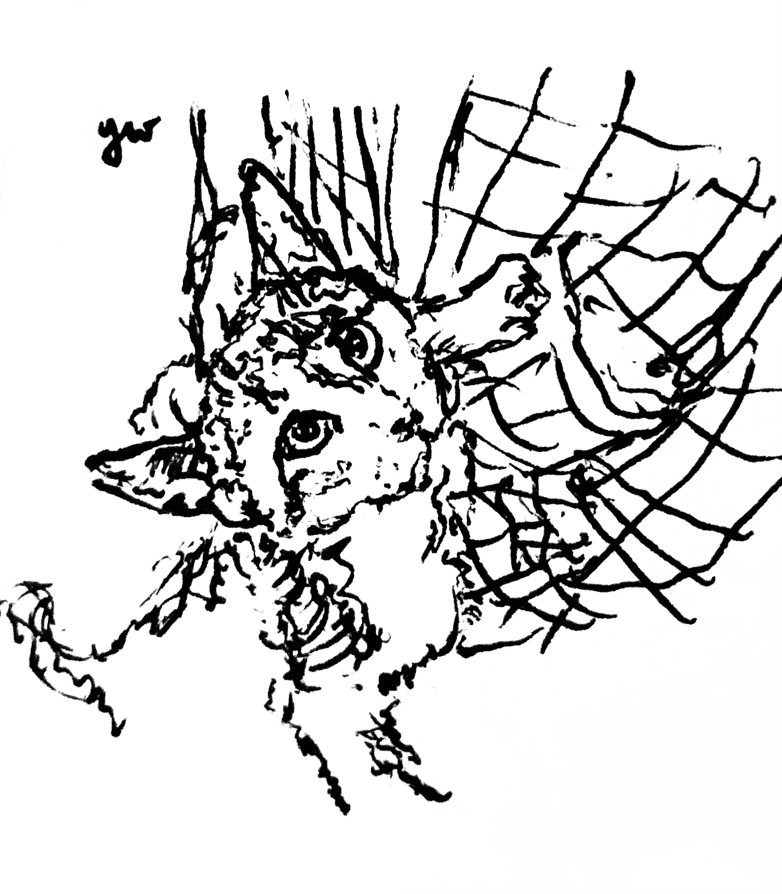
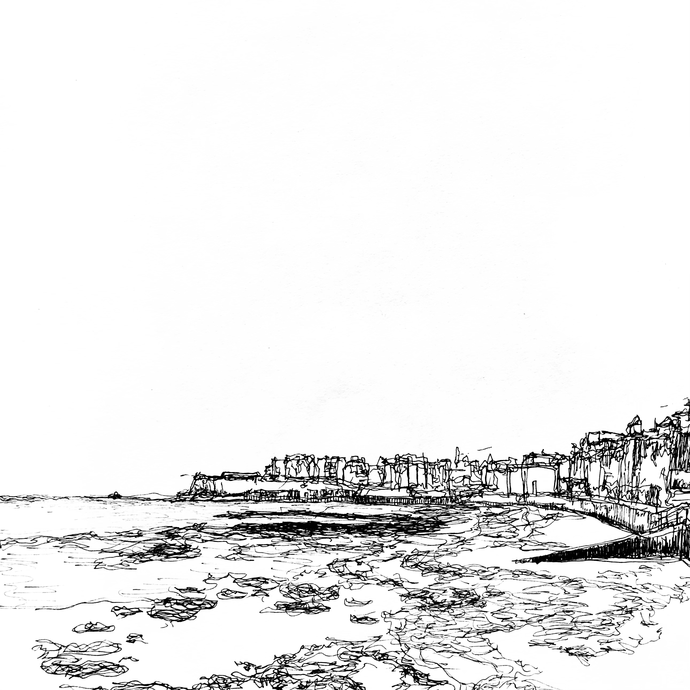
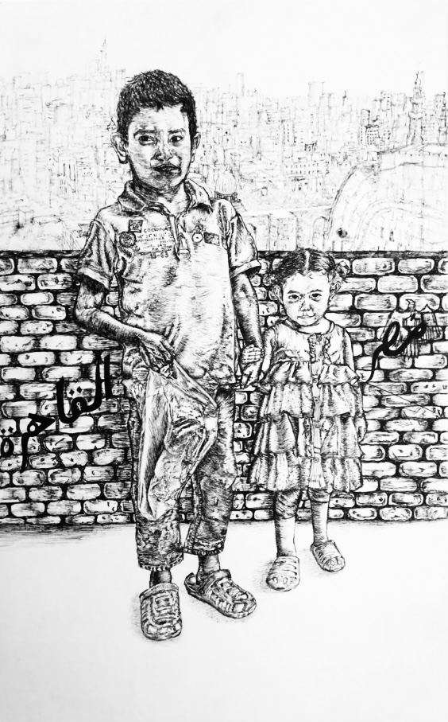
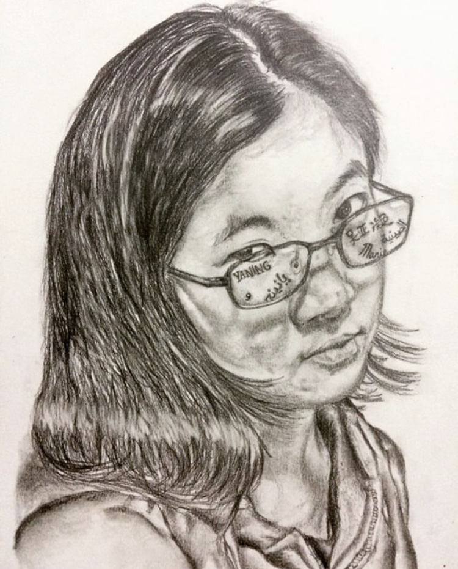

  
<b>visual art</b>

  
<b><i>good girl</i></b>, 2023. Ink on A4 sketchbook paper and digital drawing. Produced for mom's birthday.
  

  
<b><i>bridge of sighs</i></b>, 2023. Ink on A5 card and limited prints.
  

  
<b><i>the gentleman</i></b>, 2023. Ink and highlighter on postcard. Produced in support of Sobell House Hospice's <a href="https://sobellhouse.org/get-involved/my-lovely-postcards/" target="_blank">art auction</a> to fundraise for hospice care training for nurses.
  

  
<b><i>初一</i></b>, 2022. Ink on printer paper.
  

  
<b><i>birchington-on-sea</i></b>, 2021. Ink on A4 card. 
  

  
<b><i>two boys</i></b>, 2020. Ink on A4 card. Produced in support of MedSupplyDrive UK's <a href="https://www.youtube.com/watch?v=gPJOg4k1Zp4" target="_blank">art auction</a> to fundraise for protective equipment for healthcare workers during COVID-19.
  

  
<b><i>lights will guide you home</i></b>, 2020. Ink on A4 card and limited prints.
  

  
<b><i>al-qahira</i></b>, 2019. Ink on A3 card.
  

  
<b><i>bent, not broken</i></b>, 2019. Ink on A3 card.
  

  
<b><i>profit over patient</i></b>, 2019. Ink, graphite, and colour pencil on A3 card.
  

  
<b><i>patient journey</i></b>, 2019. Marker and ink on A3 card.
  

  
<b><i>cultural field studies</i></b>, 2018. Ink, marker, and colour pencil on A3 card.
  

  
<b><i>left behind</i></b>, 2018. Graphite on A4 card.
  

  
<b><i>self-portrait</i></b>, 2017. Graphite on A4 card.

 

  
<b>multimedia stories</b>
 
xxx

 

  
<b>poetry</b>
 
xxx

  
<b>data visualisation</b>
 
xxx

